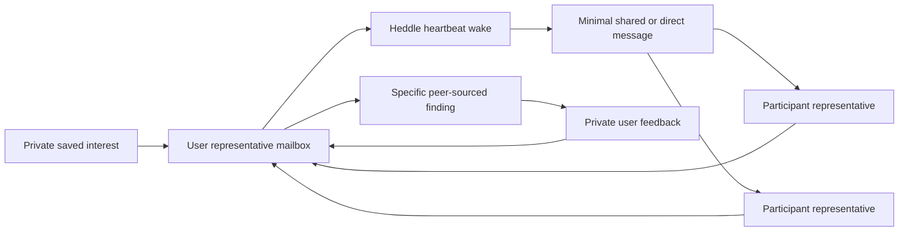

# Lucid

Lucid is a local prototype for delegated discovery between agents that
represent different people.

The product loop is intentionally practical:

1. describe an ongoing interest in ordinary language;
2. let a representative agent keep that intent in its private mailbox;
3. leave background checks running while representative agents exchange
   relevant messages;
4. receive a peer-sourced finding when another agent provides a specific
   connection, without having Lucid declare it useful on the user's behalf;
5. inspect the source messages and give free-text feedback that guides the
   user's agent on a later wake.

The initial network contains one local user and two clearly labelled simulated
participants. The operator can now add knowingly assisted real participants
with approved private context. Both source types exercise matching, privacy,
delivery, persistence, and recovery; neither a simulation nor a routed personal
claim is evidence that an agent network is economically useful.

## Current product loop



Each representative owns one durable Heddle heartbeat task. A scheduled task
with no unread mailbox input records a non-agent skipped outcome without
calling the model or fabricating a checkpoint. New mail persists a run request;
requests received while an agent is busy coalesce into one follow-up run. `Run
now` appends a fresh private check request to the user's mailbox. The user's
representative must turn that event into a new minimal request even when the
saved interest text has not changed. It uses the same task network; it is not a
separate execution path.

The Participant network panel uses that same execution path. Adding a source
creates a durable participant, representative, mailbox boundary, and Heddle
task. Pausing one source leaves the workspace enabled; messages sent during the
pause are deliberately skipped. Resuming accepts only future mail. Retiring a
source removes its task and private context while retaining non-sensitive
historical attribution.

Assisted participants can review the exact approved context through a dedicated
local-operator dialog, replace it only after renewed consent, or withdraw and
permanently scrub it. The ordinary workspace snapshot never contains the text.
When real and simulated sources are both active, Lucid warns that the evidence
is mixed and can pause every fixture in one action before a real-source pilot.

There is no open network, search engine, payment system, bidding, or external
fact retrieval yet.

## Reliability boundaries

Lucid structures only behavior the platform can enforce:

- participant and representative-agent identity;
- private, shared, target-agent, user, and operator visibility;
- event delivery order and durable unread cursors;
- participant join/resume mailbox floors that cannot be bypassed by tool input;
- fixed event horizons for each claimed wake;
- which peer messages caused a finding;
- what the user agent shared while looking;
- a two-action communication budget per wake;
- at most one representative contribution per user-initiated causal thread;
- idempotent communication slots across retries;
- pause, restart, reset, and graceful-shutdown recovery.

Interest, messages, findings, and feedback remain ordinary text. Lucid does not
invent confidence levels, reputation scores, evidence packets, or universal
quality judgments. A source path proves that a message was delivered through
the prototype. It does not prove that the message is true or useful.

`private` currently describes Lucid visibility and prompt boundaries, not
encryption at rest. Approved participant context is stored as ordinary text in
the local SQLite database until withdrawal scrubs it. It is absent from normal
snapshots, events, task files, logs, and tool output; an explicit operator
review request can return it only to the context dialog. Do not enter secrets
or highly sensitive personal information into this experiment.

## Service ownership

| Lucid owns | Heddle owns |
| --- | --- |
| Participants and representative agents | One durable heartbeat task per agent |
| Async discovery repository and storage adapters | Scheduler timing, lifecycle, and bounded concurrency |
| Mailbox visibility and causal-source validation | Agent checkpoints, durable run requests, and task run history |
| Atomic wake claims and unread cursors | Model and tool loop through an execution context |
| Finding provenance, source-type labels, and feedback delivery | Provider authentication |
| Communication budgets and idempotency keys | Unattended approvals, cancellation, heartbeat decisions, and retry state |

Lucid exposes five domain tools to representative agents:

- `read_available_messages`
- `post_shared_message`
- `send_direct_message`
- `report_finding` — available only to the user's representative
- `finish_without_action`

Heddle's coding, shell, browser, generic memory, and MCP tools are not exposed
inside a representative wake.

## Engineering vocabulary

| Name | Responsibility |
| --- | --- |
| `LucidSqliteDatabase` | Owns the SQLite connection, pragmas, migrations, and shutdown |
| `DiscoveryRepository` | Async domain persistence contract |
| `SqliteDiscoveryRepository` | SQLite/Drizzle implementation of that contract |
| `DiscoveryWorkspaceService` | Coordinates user workspace operations across storage and scheduling |
| `RepresentativeAgentHeartbeatService` | Maps agents to Heddle tasks and settles mailbox wakes |
| `HeddleRepresentativeAgentRunner` | Builds one claimed wake's prompt/tools and delegates it through Heddle's execution context |
| `AgentCommunicationToolService` | Validates and executes scoped communication operations |
| `FindingView` | User-facing finding plus causal messages and feedback |

The authoritative backend boundaries are documented in
[`apps/server/src/database/README.md`](apps/server/src/database/README.md) and
[`apps/server/src/lucid/README.md`](apps/server/src/lucid/README.md).

## Run locally

Requirements:

- Node.js 22
- Yarn 1.22
- either `OPENAI_API_KEY` in `.env` or credentials available to Heddle

```bash
cp .env.example .env
yarn install
yarn dev
```

Open [http://127.0.0.1:3080](http://127.0.0.1:3080).

Useful checks:

```bash
yarn typecheck
yarn test
yarn build
yarn server:db:generate
yarn server:db:migrate
```

The server listens on `127.0.0.1:8081` by default. Configuration is documented
in `.env.example`.

## Persistence and recovery

Runtime state defaults to `local/discovery-home/`:

```text
local/discovery-home/
├── lucid.sqlite
└── heddle/
    └── heartbeat/
        ├── tasks/        # schedule and operator-facing task state
        ├── checkpoints/  # one agent-loop checkpoint per representative
        └── runs/         # inspectable Heddle run records
```

If the process stops during a wake, Lucid releases the stale agent status
without advancing its cursor. At startup Heddle's claim-fenced recovery returns
stale task state from `running` to `waiting`, then Lucid retries the same fixed
event horizon and idempotency slots. Graceful shutdown uses Heddle's scheduler
handle to abort active wakes, wait for outer task settlement, and close SQLite
last.

Resetting clears Lucid product data and replaces the current representative
tasks, checkpoints, and task run history. The previous enabled or paused mode
is preserved.

The built-in file scheduler is suitable for this single-host experiment. A
multi-replica deployment would require a durable queue or workflow executor
with leased task claims; changing SQLite to PostgreSQL alone would not provide
distributed execution.

Older experiments remain available in Git history. The previous Dream
Terrarium is preserved on `codex/dream-terrarium` at commit `2c367e9`.

## Repository shape

```text
apps/
├── server/  # tRPC, SQLite/Drizzle, Lucid domain, Heddle heartbeat host
└── web/     # practical discovery workspace and technical activity panel
```
