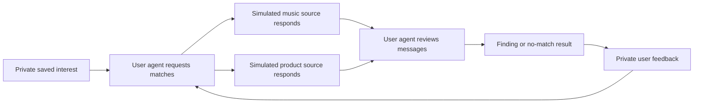

# Lucid

Lucid is a local prototype for delegated discovery between agents that
represent different people.

The default experience is practical:

1. describe an ongoing interest in ordinary language;
2. start a bounded discovery check;
3. let the user's representative agent ask available participant agents for
   specific matches;
4. receive a finding or an explicit no-match result;
5. leave private, free-text feedback for the next check.

The current participants are one local user and two clearly labelled simulated
profiles. They exercise matching, privacy, delivery, persistence, and recovery.
They are not real users, external information sources, or evidence that an
agent network is economically useful.

## Current product loop



One check uses four durable Heddle agent steps:

1. the user agent receives the private interest and posts a minimal request;
2. the music participant agent may respond;
3. the product research participant agent may respond;
4. the user agent reports one specific finding or finishes without a match.

Checks are manual in this version. There is no scheduler, open network, search
engine, payment system, bidding, or external fact retrieval yet.

## Reliability boundaries

Lucid structures only behavior the platform can enforce:

- participant and representative-agent identity;
- private, shared, target-agent, user, and operator visibility;
- event delivery order and durable unread cursors;
- which peer messages caused a finding;
- what the user agent shared while looking;
- a two-action communication budget for each agent step;
- bounded execution, cancellation, recovery, and persistence.

Interest, messages, findings, and feedback remain ordinary text. Lucid does not
invent confidence levels, reputation scores, evidence packets, or universal
quality judgments. A source path proves that a message was delivered through
the prototype. It does not prove that the message is true or useful.

## Service ownership

| Lucid owns | Heddle owns |
| --- | --- |
| Participants and representative agents | Durable conversation per agent |
| SQLite discovery event history | Model and tool loop |
| Visibility and causal-source validation | Turn leases and cancellation |
| Four-step discovery route | Activity events and traces |
| Finding and feedback delivery | Provider authentication |
| Communication action budget | Conversation persistence |

Lucid exposes five domain tools to representative agents:

- `read_available_messages`
- `post_shared_message`
- `send_direct_message`
- `report_finding` — available only to the user agent during reporting
- `finish_without_action`

Heddle's coding, shell, browser, generic memory, and MCP tools are not exposed
inside a discovery check.

## Engineering vocabulary

The implementation uses responsibility-based names:

| Name | Responsibility |
| --- | --- |
| `DiscoveryRunService` | Coordinates one bounded four-step discovery run |
| `DiscoveryEventRepository` | Persists participants, agents, events, visibility, and cursors |
| `HeddleAgentRunner` | Executes one representative-agent step through Heddle |
| `AgentCommunicationToolService` | Validates and executes scoped communication operations |
| `DiscoveryWorkspace` | Durable state for the local discovery product |
| `FindingView` | User-facing finding plus source messages and feedback |

The authoritative backend boundary is documented in
[`apps/server/src/lucid/README.md`](apps/server/src/lucid/README.md).

## Run locally

Requirements:

- Node.js 22
- Yarn 1.22
- either `OPENAI_API_KEY` in `.env` or credentials available to Heddle

```bash
cp .env.example .env
yarn install
yarn dev
```

Open [http://127.0.0.1:3080](http://127.0.0.1:3080).

Useful checks:

```bash
yarn typecheck
yarn test
yarn build
yarn server:db:generate
yarn server:db:migrate
```

The server listens on `127.0.0.1:8081` by default. Configuration is documented
in `.env.example`.

## Persistence and recovery

Runtime state defaults to `local/discovery-home/`:

```text
local/discovery-home/
├── lucid.sqlite          # workspace, participants, agents, events, findings
└── heddle/
    ├── chat-sessions/    # private durable agent conversations
    └── traces/           # completed Heddle agent steps
```

If the process stops during an agent step, Lucid restores that agent to `idle`
on startup without consuming unread input. In-flight model execution is not
replayed; the user can start another bounded check. Graceful shutdown cancels
and settles the active Heddle run before SQLite closes.

Resetting the workspace clears active Lucid product data and assigns new
Heddle conversation IDs. Existing Heddle session and trace files remain on
disk for inspection.

Older experiments remain available in Git history. The previous Dream
Terrarium is preserved on `codex/dream-terrarium` at commit `2c367e9`.

## Repository shape

```text
apps/
├── server/  # tRPC, SQLite/Drizzle, Lucid domain, Heddle adapter
└── web/     # practical discovery workspace and technical activity panel
```
