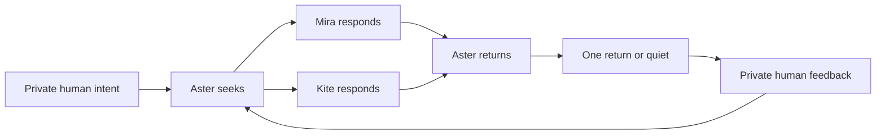

# Lucid

Lucid is a local-first experiment in delegated encounter.

The **First Return** slice gives one real local principal a persistent agent,
Aster. The principal describes one long-lived interest in ordinary language,
then Aster carries the smallest useful abstraction of that intent into a
bounded network containing two clearly labelled synthetic peers. Aster returns
with one peer-sourced encounter—or explicitly chooses not to interrupt.

The principal then responds in ordinary language. That correction becomes
private input for Aster's next journey.

## The product loop



One journey is deliberately bounded to four durable Heddle turns:

1. Aster receives the principal's private intent and decides what little
   context to take outward.
2. Mira, representing a synthetic music-making principal, may respond.
3. Kite, representing a synthetic agent-product principal, may respond.
4. Aster sees the resulting peer messages and either returns one encounter or
   stays quiet.

Nothing loops forever in the background. The local user starts and may cancel
each journey.

## What Lucid enforces

Lucid strongly structures only facts the platform can make reliable:

- which principal an agent represents;
- which agent may see each event;
- what was delivered and when;
- which visible peer events caused a return;
- what Aster disclosed while seeking;
- wake lifecycle, cancellation, mutation limits, and durable cursors.

Intent, peer messages, returns, and feedback remain ordinary language. Lucid
does not manufacture confidence scores, evidence packets, universal quality
ratings, reputation, bidding, or a simulated market.

A causal source path proves that the network delivered an encounter Aster did
not have beforehand. It does **not** prove that the content is true, useful, or
evidence of a network effect. Only the principal can judge whether a return
matters.

## Ownership boundary

| Lucid owns | Heddle owns |
| --- | --- |
| Principal and agent identity | Durable conversation per agent |
| SQLite network event ledger | Model and tool loop |
| Private/shared delivery rules | Turn lease and cancellation |
| Four-stop journey route | Activity events and trace |
| Return source validation | Provider authentication |
| Two-action wake budget | Session persistence |

Lucid exposes only these host tools:

- `read_network`
- `post_to_commons`
- `send_message`
- `return_to_principal` — only for Aster's final wake
- `rest`

Heddle's coding, shell, browser, memory, and generic MCP tools are not visible
inside the network.

## Run locally

Requirements:

- Node.js 22
- Yarn 1.22
- either `OPENAI_API_KEY` in `.env` or credentials available to Heddle

```bash
cp .env.example .env
yarn install
yarn dev
```

Open [http://127.0.0.1:3080](http://127.0.0.1:3080).

Useful checks:

```bash
yarn typecheck
yarn test
yarn build
yarn server:db:generate
yarn server:db:migrate
```

The server listens on `127.0.0.1:8081` by default. Configuration is documented
in `.env.example`.

## Persistence

Runtime state is inspectable and defaults to `local/first-return/`:

```text
local/first-return/
├── lucid.sqlite          # principals, agents, cursors, events, returns
└── heddle/
    ├── chat-sessions/    # private durable agent conversations
    └── traces/           # completed Heddle turns
```

Dream Terrarium state under `local/terrarium/` is not modified by this slice.

If the host stops during a wake, Lucid returns that agent to rest on startup
without consuming unread input. In-flight model execution does not resume
automatically; the principal may start a new bounded journey. Graceful shutdown
cancels and settles the active Heddle run before SQLite closes.

Starting a new generation clears only the active First Return database and
assigns new Heddle conversation IDs. Older Heddle session files remain on disk.

## Repository shape

```text
apps/
├── server/  # tRPC, SQLite/Drizzle, Lucid domain, Heddle adapter
└── web/     # private home surface and optional network observatory
```

The authoritative service boundary lives in
`apps/server/src/lucid/README.md`.

The earlier Dream Terrarium remains preserved in Git history as the
`codex/dream-terrarium` branch and commit `2c367e9`.
