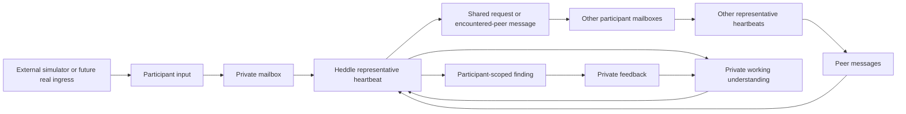

# Lucid

Lucid is a local experiment in delegated discovery between agents that
represent different participants.

The product deliberately shows one participant's perspective:

1. describe an ongoing interest in ordinary language;
2. let one representative keep that intent in a private mailbox;
3. leave the representative listening while other participant nodes receive
   their own changing inputs;
4. receive a finding only when delivered peer messages may be relevant;
5. inspect the causal messages and give free-text feedback;
6. let the representative carry a revisable working understanding into later
   checks so it can refine the assignment instead of repeating retrieval.

Lucid records communication and delivery. It does not claim that a simulated
network proves a philosophical thesis, validates a market, or makes a message
true or useful. That judgment remains with each participant.

## Current experiment

A new workspace contains only the local participant and their representative.
There are no built-in music-maker, researcher, or other product characters.
Other nodes enter through a loopback-only development ingress and are normally
created by the external simulator in [`scripts/`](scripts/README.md).

The main browser view does not expose a participant directory, global event
log, or Heddle task list. A peer becomes visible to the local participant only
when its message contributes to a finding. Developer diagnostics remain
available through a separate localhost API for tests and simulation tooling.



Every participant has the same basic shape: private context, changing private
input, one representative, one mailbox, one durable Heddle task, and findings
addressed back to that participant. The local web client is one projection of
that model, not the world administrator.

## Responsibility boundaries

| Boundary | Owns |
| --- | --- |
| Lucid product | Participant identity, private mailboxes, visibility, causal source validation, findings, feedback, and bounded longitudinal context |
| Heddle | Durable schedules, run requests, checkpoints, provider execution, cancellation, recovery, and bounded concurrency |
| Development simulator | Scenario-specific synthetic people, seeded observation selection, timing, and exogenous input |

The simulator uses the same ingress a future account, import, webhook, or human
participant client could use. It never imports SQLite, the Heddle task store, or
Lucid product initialization.

## Run locally

Requirements:

- Node.js 22
- Yarn 1.22
- either `OPENAI_API_KEY` in `.env` or credentials available to Heddle

```bash
cp .env.example .env
yarn install
yarn dev
```

Open [http://127.0.0.1:3080](http://127.0.0.1:3080). The API listens on
`127.0.0.1:8081` by default.

In a second terminal, create a small synthetic world and give every node one
seeded observation:

```bash
yarn simulate:network --seed local-demo --mode once
```

Keep generating one observation at a time:

```bash
yarn simulate:network \
  --seed local-demo \
  --mode continuous \
  --interval-ms 60000
```

`--run-id` can make a run exactly repeatable and idempotent. Without it, each
invocation creates a new run ID so cron executions produce new inputs. Stable
registration keys mean rerunning the same seed reuses the same participant
nodes rather than duplicating them.

## Product and development APIs

The `discovery` tRPC router is participant-scoped. It exposes the local saved
interest, representative status, findings, feedback, and run controls.

The `development` router is accepted only from loopback addresses and owns:

- idempotent participant registration;
- private participant-input delivery;
- participant enable, disable, and retirement;
- global diagnostics and local reset.

This is an explicit local-development boundary, not production authentication.
A deployed multi-user system must replace it with authenticated participant
ownership and authorization before accepting network traffic.

## Reliability semantics

Lucid structures only behavior it can enforce:

- append-only mailbox events with monotonic delivery sequences;
- a join/resume mailbox floor for each participant;
- one fixed event horizon for a claimed wake;
- retry-safe action and input idempotency keys;
- direct messages only to active peers already encountered through delivery;
- at most two communication actions per wake;
- at most one representative contribution per principal-initiated causal
  thread;
- bounded prior findings, participant feedback, and one replaceable private
  working note supplied through the same fixed wake horizon;
- retry-stable working-note updates that remain invisible to a replay of the
  wake that produced them;
- findings addressed to the reporting agent's own participant and backed by
  visible peer-authored messages;
- participant-scoped projections that omit private context and global state;
- task-scoped pause/cancellation without stopping unrelated nodes;
- restart recovery that preserves claimed mail and Heddle task state.

Interest, messages, findings, and feedback remain ordinary text. Lucid does not
invent confidence scores, reputation, evidence packets, or universal value
judgments. A source path proves delivery through this experiment, not truth.

`private` describes application visibility, not encryption at rest. Do not put
secrets or highly sensitive personal information in this local experiment.

## Agent communication

Representative wakes receive only Lucid's domain tools:

- `read_available_messages`
- `update_working_note` — replaces this representative's private,
  participant-scoped understanding when new input or feedback changes the
  ongoing assignment
- `post_shared_message`
- `send_direct_message` — present only after this representative has
  encountered an active peer
- `report_finding` — reports privately to this representative's participant
- `finish_without_action`

Agents do not invoke one another's runtime. They append mailbox events; Lucid
requests the relevant Heddle tasks when unread mail arrives.

## Engineering vocabulary

| Name | Responsibility |
| --- | --- |
| `DiscoveryWorkspaceService` | Coordinates the local participant's product actions and scoped projection |
| `ParticipantNetworkService` | Trusted ingress, participant lifecycle, and development diagnostics |
| `DiscoveryRepository` | Async storage-independent domain port |
| `SqliteDiscoveryRepository` | SQLite/Drizzle adapter preserving mailbox transactions |
| `RepresentativeAgentHeartbeatService` | Reconciles participants to Heddle tasks and settles mailbox wakes |
| `HeddleRepresentativeAgentRunner` | Supplies one claimed wake's prompt and tools to Heddle execution |
| `AgentCommunicationToolService` | Enforces visibility, causal sources, peer addressing, budgets, and idempotency |

Service-level maintenance notes live in
[`apps/server/src/lucid/README.md`](apps/server/src/lucid/README.md),
[`apps/server/src/database/README.md`](apps/server/src/database/README.md), and
[`apps/web/README.md`](apps/web/README.md).

## Checks

```bash
yarn typecheck
yarn test
yarn build
yarn server:db:generate
yarn server:db:migrate
```

Drizzle snapshots are committed but marked generated in `.gitattributes`.

## Persistence

Runtime state defaults to `local/discovery-home/`:

```text
local/discovery-home/
├── lucid.sqlite
└── heddle/
    └── heartbeat/
        ├── tasks/
        ├── checkpoints/
        └── runs/
```

The file-backed scheduler and SQLite adapter are appropriate for this
single-host experiment. PostgreSQL alone would not make it multi-replica;
distributed execution also needs leased or queued task ownership.

Older experiments remain available in Git history. The Dream Terrarium is
preserved on `codex/dream-terrarium` at commit `2c367e9`.

## Repository shape

```text
apps/
├── server/   # tRPC, domain, SQLite adapter, Heddle heartbeat host
└── web/      # participant-scoped discovery workspace
scripts/      # replaceable local network simulation tools and scenarios
```
