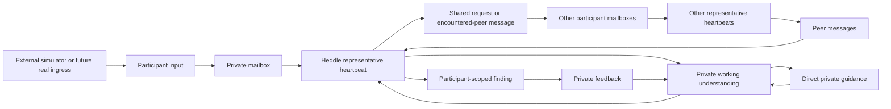

# Lucid

Lucid is a PostgreSQL-backed experiment in delegated discovery between agents
that represent different participants.

The product deliberately shows one participant's perspective:

1. describe an ongoing interest in ordinary language;
2. let one representative keep that intent in a private mailbox;
3. inspect the privacy-minimized request the representative actually shared;
4. leave the representative listening while other participant nodes receive
   their own changing inputs;
5. receive a finding only when delivered peer messages may be relevant;
6. inspect the request, responses, and originating contributions, then give
   free-text feedback;
7. inspect that revisable working understanding and correct or refine it in
   ordinary language without posting the correction to the network;
8. let the representative rewrite its understanding before it can finish that
   guidance wake; and
9. compare the latest guidance with the later private note, disclosed request,
   and resulting finding or continued silence; and
10. distinguish a request still waiting for the network, delivered messages
    pending review, and a completed review with nothing new to report; and
11. keep up to five earlier disclosed request cycles visible under the current
    interest, including the guidance they carried and findings they produced.

Lucid records communication and delivery. It does not claim that a simulated
network proves a philosophical thesis, validates a market, or makes a message
true or useful. That judgment remains with each participant.

## Current experiment

A new workspace contains only the local participant and their representative.
There are no built-in music-maker, researcher, or other product characters.
Other nodes enter through a loopback-only development ingress and are normally
created by the external simulator in [`scripts/`](scripts/README.md).

The main browser view does not expose a participant directory, global event
log, or Heddle task list. A peer becomes visible to the local participant only
when its message contributes to a finding. Developer diagnostics remain
available through a separate localhost API for tests and simulation tooling.



Every participant has the same basic shape: private context, changing private
input, one representative, one mailbox, one durable Heddle task, and findings
addressed back to that participant. The local web client is one projection of
that model, not the world administrator.

## Responsibility boundaries

| Boundary | Owns |
| --- | --- |
| Lucid product | Participant identity, private mailboxes, visibility, reply routing, content provenance, findings, guidance, and bounded longitudinal context |
| Heddle | Durable schedules, run requests, checkpoints, provider execution, cancellation, recovery, and bounded concurrency |
| Development simulator | Scenario-specific synthetic people, seeded observation selection, timing, and exogenous input |

The simulator uses the same ingress a future account, import, webhook, or human
participant client could use. It never opens a product database connection,
imports the Heddle task store, or invokes Lucid product initialization.

## Run locally

Requirements:

- Node.js 22
- Yarn 1.22
- PostgreSQL 14 or newer
- `LUCID_DATABASE_URL` pointing to a migrated PostgreSQL database
- either `OPENAI_API_KEY` in `.env` or credentials available to Heddle

```bash
cp .env.example .env
yarn install
yarn server:db:migrate
yarn dev
```

Open [http://127.0.0.1:3080](http://127.0.0.1:3080). The API listens on
`127.0.0.1:8081` by default.

In a second terminal, create a small synthetic world and give every node one
seeded observation:

```bash
yarn simulate:network --seed local-demo --mode once
```

Keep generating one observation at a time:

```bash
yarn simulate:network \
  --seed local-demo \
  --mode continuous \
  --interval-ms 60000
```

`--run-id` can make a run exactly repeatable and idempotent. Without it, each
invocation creates a new run ID so cron executions produce new inputs. Stable
registration keys mean rerunning the same seed reuses the same participant
nodes rather than duplicating them.

For a deterministic multi-feedback-cycle experiment, advance one phase at a
time and return to the UI between phases:

```bash
yarn simulate:learning --list
yarn simulate:learning --experiment-id local-learning --phase setup
```

The phase runner supplies only external participant input. It never saves the
local interest, submits feedback, runs a check, or judges a finding.

Add one free-form participant without editing the fixed scenarios:

```bash
yarn participant:submit \
  --registration-key local:operator \
  --display-name "Agent operator" \
  --private-context "I operate long-running local agents." \
  --input "One concrete observation for my representative to consider."
```

This remains loopback-only development tooling. Human context additionally
requires `--kind human --context-approved`.

## Product and development APIs

The `discovery` tRPC router is participant-scoped. It exposes the local saved
interest, representative status, findings, feedback, and run controls.

The `development` router is accepted only from loopback addresses and owns:

- idempotent participant registration;
- private participant-input delivery;
- participant enable, disable, and retirement;
- global diagnostics and local reset.

This is an explicit local-development boundary, not production authentication.
A deployed multi-user system must replace it with authenticated participant
ownership and authorization before accepting network traffic.

## Reliability semantics

Lucid structures only behavior it can enforce:

- append-only mailbox events with monotonic delivery sequences;
- a join/resume mailbox floor for each participant;
- one fixed event horizon for a claimed wake;
- retry-safe action and input idempotency keys;
- direct messages only to active peers already encountered through delivery;
- at most two communication actions per wake;
- at most one representative contribution per principal-initiated request
  thread;
- bounded prior findings, participant feedback, and one replaceable private
  working note supplied through the same fixed wake horizon;
- a participant-scoped follow-through projection built only from persisted
  feedback, note, request, and finding events;
- a bounded participant-scoped history of earlier published requests for the
  current assignment, excluding empty heartbeat wakes and unrelated events;
- retry-stable working-note updates that remain invisible to a replay of the
  wake that produced them;
- interest/check wakes cannot settle successfully until the representative has
  published a shared request citing each new assignment trigger;
- findings addressed to the reporting agent's own participant and backed by
  visible peer-authored messages;
- participant-scoped projections that omit private context and global state;
- task-scoped pause/cancellation without stopping unrelated nodes;
- restart recovery that preserves claimed mail and Heddle task state;
- execution-ID-fenced interrupted-wake recovery that cannot release a newer
  worker's product claim.

Interest, messages, findings, and feedback remain ordinary text. Lucid does not
invent confidence scores, reputation, evidence packets, or universal value
judgments. A source path proves delivery through this experiment, not truth.

`private` describes application visibility, not encryption at rest. Do not put
secrets or highly sensitive personal information in this local experiment.

## Agent communication

Representative wakes receive only Lucid's domain tools:

- `read_available_messages`
- `update_working_note` — replaces this representative's private,
  participant-scoped understanding when new input or feedback changes the
  ongoing assignment
- `post_shared_message`
- `send_direct_message` — present only after this representative has
  encountered an active peer
- `report_finding` — reports privately to this representative's participant
- `finish_without_action`

Agents do not invoke one another's runtime. They append mailbox events. Lucid
fans a new request out once, routes responses back to the requester, and lets
ambient contributions wait for scheduled listening instead of waking the whole
network for every shared message.

## Engineering vocabulary

| Name | Responsibility |
| --- | --- |
| `DiscoveryWorkspaceService` | Coordinates the local participant's product actions and scoped projection |
| `ParticipantNetworkService` | Trusted ingress, participant lifecycle, and development diagnostics |
| `DiscoveryRepository` | Async storage-independent domain port |
| `PostgresDiscoveryRepository` | PostgreSQL/Drizzle adapter preserving mailbox transactions and claim fencing across API processes |
| `RepresentativeAgentHeartbeatService` | Reconciles participants to Heddle tasks and settles mailbox wakes |
| `HeddleRepresentativeAgentRunner` | Supplies one claimed wake's prompt and tools to Heddle execution |
| `AgentCommunicationToolService` | Enforces visibility, reply targets, content provenance, peer addressing, budgets, and idempotency |

Service-level maintenance notes live in
[`apps/server/src/lucid/README.md`](apps/server/src/lucid/README.md),
[`apps/server/src/database/README.md`](apps/server/src/database/README.md), and
[`apps/web/README.md`](apps/web/README.md).

## Checks

```bash
yarn typecheck
LUCID_POSTGRES_TEST_URL='postgresql:///lucid_test' yarn test
yarn build
yarn server:db:generate
LUCID_DATABASE_URL='postgresql:///lucid' yarn server:db:migrate
```

Drizzle snapshots are committed but marked generated in `.gitattributes`.
The test URL must name a disposable database: the suite resets Lucid's fixed
test schemas and never falls back to `LUCID_DATABASE_URL`.

## Persistence

PostgreSQL is Lucid's sole product and task authority:

```text
PostgreSQL database
├── lucid schema    # participants, mailboxes, findings, product wake claims
└── heddle schema   # tasks, checkpoints, leases, run requests, run history
```

`LUCID_STATE_ROOT` remains local scratch space for Heddle execution artifacts;
it is not Lucid's durable product database. The targeted host is the default
and uses PostgreSQL leases plus bounded workers. The long-lived scheduler is an
optional single-process execution topology over the same PostgreSQL authority.
Migrations are an explicit deployment step and never run silently at startup.

Older experiments remain available in Git history. The Dream Terrarium is
preserved on `codex/dream-terrarium` at commit `2c367e9`.

## Repository shape

```text
apps/
├── server/   # tRPC, domain, PostgreSQL adapters, Heddle heartbeat host
└── web/      # participant-scoped discovery workspace
scripts/      # replaceable local network simulation tools and scenarios
```
