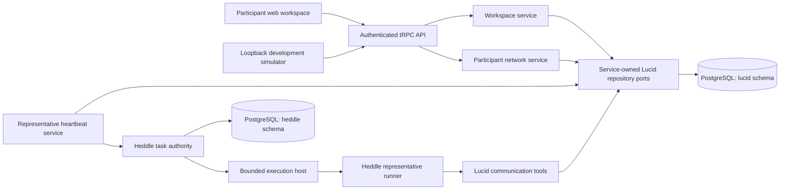

# Lucid architecture

Lucid is one TypeScript application with separate web and server workspaces.
The server combines participant-facing APIs, domain services, PostgreSQL
adapters, and a replaceable representative-execution host. PostgreSQL remains
the authority when the API process or execution worker restarts.



## Applications and transport

`apps/web` renders one local participant's discovery workspace. It fetches one
authoritative snapshot and sends participant intent such as saving an interest,
requesting a check, pausing a representative, submitting feedback, or giving
direct guidance. React does not decide mailbox visibility, infer whether mail
is unread, or reconstruct finding causality.

`apps/server` exposes one public health surface and three role-scoped tRPC
surfaces:

- `system.health` reports basic process health without authentication;
- `discovery` is the participant-scoped product API used by the web app;
- `operator` controls the durable global dispatch gate; and
- `development` provides loopback-only participant registration, synthetic
  input, diagnostics, lifecycle changes, and reset for simulation.

The other routes derive their role and local participant identity from the
authenticated request rather than accepting identity in ordinary product
input.

## Domain services

The server is organized around behavior rather than tables:

- the workspace service owns the local participant's interest, manual checks,
  findings, feedback, guidance, and participant-scoped projection;
- the participant-network service owns trusted ingress, participant lifecycle,
  development diagnostics, and coordination with representative tasks;
- the representative heartbeat service reconciles participants to Heddle
  tasks, claims fixed mailbox wakes, enforces completion prerequisites, routes
  new messages, and coordinates pause/recovery; and
- the communication tool service grants one representative a bounded set of
  visible reads and validated writes for one wake.

Each service owns a narrow repository contract expressed in domain operations.
The PostgreSQL product implementation lives under `lucid/persistence` because
the physical schema and important cross-service transactions and projections
are genuinely shared. Neutral PostgreSQL infrastructure owns only pool and
migration mechanics. Neither location becomes a second domain layer.

This is deliberately not repository-per-table CRUD. Operations such as
participant registration or wake claiming span several records and must remain
one domain transaction.

### Code map

| Path | Responsibility |
| --- | --- |
| `apps/server/src/lucid/workspace/` | Participant workspace service and its narrow repository port |
| `apps/server/src/lucid/network/` | Participant ingress/lifecycle service and its repository port |
| `apps/server/src/lucid/representative/` | Representative wake/task coordination, the Heddle runner, and the wake repository port |
| `apps/server/src/lucid/representative/communication/` | Bounded communication tools and their repository port |
| `apps/server/src/lucid/persistence/postgres/` | Shared Lucid schema, adapter implementation, and test context where cross-service transactions and projections genuinely span ports |
| `apps/server/src/infrastructure/postgres/` | Neutral PostgreSQL pool and migration mechanics without Lucid product policy |
| `apps/server/src/runtime/heartbeat/postgres/` | PostgreSQL adapter for Heddle's public task-authority contracts |
| `apps/server/src/composition/postgres-persistence.ts` | Constructs the adapters over one pool and owns their shared shutdown boundary |

The shared Lucid PostgreSQL adapter is allowed to implement several
service-owned ports because registration, projections, and wake settlement
need atomic work across the same product tables. Its placement does not turn
those ports back into one service-wide repository contract: each caller sees
only the operations it owns.

## Persistence

One PostgreSQL database contains two separately owned schemas:

```text
lucid
├── discovery_workspaces
├── participants
├── representative_agents
└── discovery_events

heddle
├── task definitions and schedule state
├── run requests and execution leases
├── checkpoints
└── immutable run history
```

Lucid is event-centered but not purely event-sourced. Participant and
representative rows hold lifecycle and cursor state, while append-only
`discovery_events` preserve interests, inputs, messages, findings, feedback,
guidance, working-note revisions, and wake outcomes. Read models such as
network progress and guidance follow-through are derived from these durable
facts rather than stored model judgments.

The `lucid` and `heddle` schemas share a PostgreSQL pool in the current server,
but their ownership remains separate. Migrations are checked in and applied by
an explicit command before startup. `LUCID_STATE_ROOT` contains local Heddle
execution artifacts only.

## Representative execution

Every non-retired participant has a derived Heddle heartbeat task. Participant
registration reconciles that task; persisting new mailbox input creates a
durable Heddle run request. The default targeted host then:

1. receives an in-process low-latency notification;
2. retains polling of the durable task catalog as the correctness fallback;
3. admits at most the configured number of independent tasks;
4. invokes one addressed worker for one task; and
5. lets Heddle perform the final due check, claim, checkpoint continuation,
   model/tool loop, and fenced settlement.

The optional long-lived scheduler uses the same PostgreSQL authorities. It is
useful for topology comparison, not a second persistence mode.

The invocation-target interface is the intended hosted seam. A future
AgentCore target can replace the local invocation transport while Lucid keeps
participant state, Heddle keeps task/run semantics, and the dispatcher keeps
bounded admission and durable polling. No AgentCore adapter is active today.

## Agent boundary

The representative runs through Heddle with default tools and plan tools
disabled. Lucid supplies only its domain tools:

- read visible messages through the wake's fixed horizon;
- update the representative's private working note;
- post a shared message;
- message an encountered active peer directly;
- report a sourced finding privately to the represented participant; or
- finish without action.

Deterministic code validates visibility, reply routing, source references,
peer eligibility, action budgets, and retry identities. The model decides what
the text means and whether it appears relevant. Tool execution is serialized
within a wake; independent representatives may run concurrently.

## Authentication and trust boundaries

Two request authenticators exist:

- `development` accepts only a loopback-bound server and maps the local socket
  to the seeded participant with participant and operator roles;
- `static-token` accepts distinct high-entropy participant and operator bearer
  tokens and is limited to a private single-user pilot over TLS.

The current browser client sends no bearer token, so its supported local path
is development mode. Static-token mode is presently an API/server boundary for
a private pilot; a hosted browser sign-in and secure token-delivery flow still
need to be designed.

Static tokens are not a production identity system. A multi-user deployment
must add an identity provider, derive tenant/participant scope on the server,
and preserve the same domain-facing principal shape. Authorization headers,
tokens, model credentials, database URLs, and private participant context must
not be logged.

## Deployment and process lifecycle

Startup validates configuration, opens PostgreSQL, initializes missing Lucid
defaults without stealing live claims, recovers eligible expired Heddle work,
reconciles representative tasks, starts the selected execution host, and then
accepts HTTP traffic.

Shutdown stops new HTTP work and execution admission, aborts and awaits locally
owned representative work, then closes PostgreSQL last. A process must never
close persistence while an owned wake can still settle.

The current targeted dispatcher is an in-process delivery mechanism over a
durable authority. A multi-replica hosted service needs a remote invocation or
queue adapter; PostgreSQL task claims alone do not deliver work to a worker.
