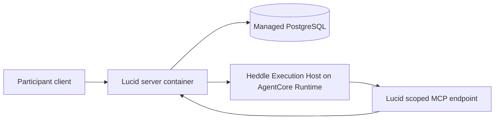

# Deploying the Lucid pilot

Lucid's first hosted topology is deliberately small: one managed PostgreSQL
database, one Lucid server container, and one separately managed Heddle
Execution Host Runtime. This repository contains a portable server image and
configuration contract. It contains no deployment-specific account IDs,
database endpoints, credentials, Terraform state, or other environment data.

This is a private single-user pilot posture, not a highly available or
multi-user production architecture.

## Ownership map



- Lucid owns participant authentication, product authorization, signed
  invocation authority, PostgreSQL data, and the exact MCP tools exposed to a
  turn.
- The private Execution Host owns the Heddle loop and isolated shell
  workspace. It receives no database credential.
- The AWS SDK in Lucid uses its standard credential provider chain. On EC2,
  grant the instance role only `bedrock-agentcore:InvokeAgentRuntime` for the
  selected Runtime ARN instead of injecting static AWS keys.

The Runtime configuration must allow these three adopter-defined headers:

```text
x-heddle-execution-host-assertion
x-heddle-execution-host-mcp-capability
x-heddle-execution-host-model-api-key
```

The AgentCore Runtime session header is part of the managed invocation API and
is not one of the custom allowlist entries.

## Build the server image

The checked-in Dockerfile targets ARM64 so the same artifact can run on a
small Graviton EC2 instance:

```bash
yarn server:docker:build
```

The final image:

- runs as the non-root `node` user under `tini`;
- stores non-authoritative local Heddle artifacts under `/var/lib/lucid`;
- exposes port `8081` and a process-liveness probe at `GET /healthz`;
- includes the compiled migration entrypoint and checked-in Drizzle
  migrations; and
- contains no environment configuration or credentials.

The health route proves that the Node process can answer HTTP. It deliberately
does not claim that PostgreSQL, AgentCore, or model providers are ready.

## Configure without coupling the repository

Use [`.env.hosted.example`](../.env.hosted.example) as the deployment contract.
Provide its values through the target platform's secret and configuration
mechanisms. Never bake a populated file into the image.

Required environment-specific inputs are:

- a TLS PostgreSQL URL reachable from the server container;
- a public HTTPS Lucid origin reachable from the Runtime;
- static pilot participant/operator tokens;
- an owner-readable ES256 private JWK file;
- model credentials;
- product authority IDs and distinct execution/MCP audiences; and
- the AgentCore region, Runtime ARN, and optional endpoint qualifier.

Some managed PostgreSQL providers expose an IPv6-only direct endpoint. An
IPv4-only host should use the provider's IPv4-capable session pooler rather
than buying an address add-on solely for this demo.

## Release sequence

Migrations are an explicit deployment step and ordinary startup never mutates
the database schema:

```bash
docker run --rm \
  --env-file /path/to/deployment.env \
  lucid-server:local \
  node apps/server/dist/migrate.js
```

The migration environment only needs the database URL. Then start the same
immutable image with the full configuration and signing-key secret mount. A
new workspace is created with background checks disabled, so image startup and
migrations alone do not initiate model work. Only an explicit operator resume
or hosted conversation request can spend model/Runtime budget.

For this demo stage, local Terraform apply and an intentionally manual image
rollout are easier to audit than merge-triggered deployment. CI should build
and verify the image; automatic apply can wait until rollback, secret
management, and environment promotion are worth operating.

## Evidence boundary

The repository tests prove request signing, custom-header placement, strict
SSE handling, cancellation propagation, configuration validation, and the
paused database default without contacting AWS. They do not prove managed
AgentCore header forwarding, microVM isolation, workload-role containment,
runtime lifecycle, or real cost. Those claims require a separately approved,
budget-bounded managed smoke test.
