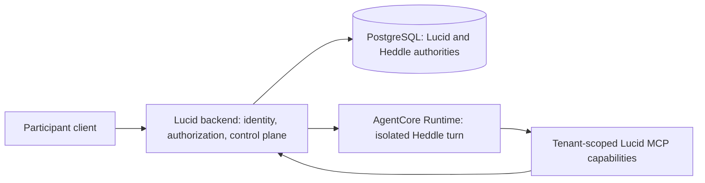

# Hosted agent runtime

Lucid includes a separate, generic Heddle runtime experiment for validating a
hosted workstation-style agent. It is deliberately not the Lucid backend, a
remote representative worker, or evidence that AWS AgentCore already satisfies
Lucid's multi-tenant requirements.

The current package is the first protocol and container scaffold. It has
focused deterministic coverage for validation, scope binding, health,
streaming, conflict handling, and local disconnect cancellation. The complete
W1–W4 workload harness has not passed yet, and no managed AgentCore runtime has
been deployed.

## What this experiment must prove

The target is closer to a hosted Claude Code, Codex, or Heddle CLI session than
to a short model callback. Within an explicitly isolated Linux environment, one
turn may inspect and edit files, run child processes and shell commands, make
outbound HTTP requests, reduce large inputs with scripts, and stream useful
progress for a long-running task.

The isolation boundary is primarily a tenant boundary. If one Heddle adopter
serves companies A and B, company B must not inherit company A's files, process
state, credentials, logs, or other artifacts. AgentCore's session isolation can
provide one layer of that boundary, but it does not replace application
identity, authorization, capability scoping, redaction, or durable ownership.

The first workloads are intentionally generic:

1. **W1 — tenant isolation:** attempt cross-scope reads through files,
   processes, environment, capabilities, logs, and warm reuse;
2. **W2 — repository engineering:** inspect, modify, test, and explain a
   deterministic multi-file repository fixture;
3. **W3 — data reduction:** fetch a 25–100 MB deterministic fixture, process it
   with local scripts, and return a small cited result without placing the raw
   input in model context; and
4. **W4 — lifecycle:** exercise streaming, disconnect, cancellation, process
   cleanup, interruption, and recovery during a long turn.

Lucid representative execution is a later workload, not a shortcut around
these gates.

## Local runtime contract

`apps/agent-runtime` is a thin HTTP and isolation adapter around Heddle. Its
AgentCore-compatible surface is:

- `GET /ping`, returning AgentCore's `Healthy` or `HealthyBusy` status;
- one `POST /invocations` for one complete Heddle turn, with activity streamed
  as server-sent events through exactly one terminal event; and
- `X-Amzn-Bedrock-AgentCore-Runtime-Session-Id` as the runtime-session header.

The adapter admits only one active turn. It does not split a turn into separate
start, subscribe, status, or cancel invocations. A client disconnect cancels
that exact local in-process run; it does not establish AgentCore force-stop or
reconnect semantics.

`invocationId` is a correlation identifier. A warm process rejects only its
128 most recently completed identifiers as bounded duplicate suppression.
Durable idempotency, retry ownership, and recovery belong to the future Lucid
control plane and cannot be inferred from this process-local cache.

On the first accepted request, one runtime process binds immutably to this
scope:

```text
runtime session + adopter + tenant + user + conversation
```

A later request that changes any member of that scope is rejected. This is a
fail-closed defense within the process, not proof that two tenants have
separate infrastructure.

Local mode requires both a high-entropy runtime token and an explicit assertion
that the process is running in an isolated environment. The full workstation
tool profile must run only in a dedicated container or an isolation provider
such as AgentCore. Running the process directly on a shared developer host can
exercise protocol behavior, but it must not be described as tenant isolation.

`LUCID_AGENT_RUNTIME_LOCAL_TOKEN` stays in the caller shell. The container
receives only `LUCID_AGENT_RUNTIME_LOCAL_TOKEN_SHA256`, a one-way verifier that
cannot itself authenticate a request. The plaintext token is therefore absent
from container configuration, process environments, and health-check processes.
The caller sends the token through `X-Lucid-Local-Runtime-Token`. It
authenticates access to
the adapter; it does not identify a tenant. The caller still supplies the
complete scope, which is permanently bound after the first request. A model
API key is accepted only through the `X-Lucid-Model-Api-Key` request header for
that turn. The container must not mount a developer credential home, and
request credentials must not be exposed to the model, shell, child processes,
logs, or response stream. In AgentCore mode, platform ingress authorization
replaces the local token and the custom model-key header must be explicitly
allowlisted.

The runtime receives no PostgreSQL connection string or other Lucid database
credential. It has no Lucid MCP tools today and therefore cannot execute a
Lucid representative wake. Its local filesystem is scratch and artifact state,
not canonical Lucid product state.

The workstation shell may be able to reach credentials exposed by AgentCore's
workload-role metadata path. A deployed runtime role must therefore be
least-privilege and must not grant database, tenant-data, deployment, or broad
AWS administration access. This needs a managed W1 test; a local container
cannot certify it.

## What local validation can and cannot establish

| Can be established locally | Requires a managed AgentCore deployment |
| --- | --- |
| Request validation, SSE ordering, one terminal event, and health transitions | Real AgentCore ingress, routing, header propagation, and streaming limits |
| Heddle file, shell, process, network, and artifact behavior in the pinned image | Managed ARM64 image startup and provider CPU, memory, disk, and egress behavior |
| Immutable scope rejection inside one process | A distinct microVM and sanitized memory, files, and processes for each tenant session |
| Cross-container scratch separation under the local container engine | Warm-session reuse and cleanup after an AgentCore session terminates |
| Client-disconnect cancellation and local child-process cleanup | Provider force-stop, signals, session stop, draining, and interruption behavior |
| Deterministic W1–W4 fixtures and measured local resource use | Long managed runs, cold/warm latency, observability isolation, and actual AWS cost |

A passing local suite is a prerequisite for a paid spike. It is not a claim of
AgentCore or SOC 2 compliance.

## Future Lucid boundary

The intended hosted shape keeps Lucid as the control and data plane:



The backend derives tenant and participant scope from authenticated identity,
owns durable task and wake claims, invokes the runtime, and remains the only
component that reads or writes PostgreSQL. The runtime owns only Heddle's
model/tool loop and isolated temporary work. It eventually calls a curated
Lucid MCP surface using a short-lived capability bound to the adopter, tenant,
participant, conversation, runtime session, allowed operations, and expiry.
The backend revalidates that capability for tool discovery and every tool
call. MCP exposes product abilities, not database CRUD.

That MCP server does not exist yet. The current communication tool service also
retains wake-local state, so its policy must first become suitable for
stateless authenticated calls without weakening idempotency, visibility,
provenance, or action budgets.

## The current representative host is not the remote seam

`RepresentativeTaskInvocationTarget` is replaceable only inside the current
server process. Its invocation carries an `AbortSignal`; composition passes a
handler closure into the target; and `RepresentativeAgentWorker` owns the
PostgreSQL-backed Heddle task store used for claim, checkpoint, and settlement.
Those values cannot be serialized into a database-free AgentCore runtime.

A hosted Lucid integration therefore needs a small public, provider-neutral
Heddle execution port. The backend should keep durable Heddle task ownership
and Lucid wake fencing, prepare an authorized turn, and send only the execution
input and scoped capabilities to the runtime. The runtime should execute that
turn through Heddle's public API and return its streamed result without
reimplementing Heddle's loop or gaining direct database access. The exact port
belongs in Heddle and should be validated there before Lucid adds a remote
target.

## Safety rules

- Never inject `LUCID_DATABASE_URL` or database credentials into the runtime.
- Never derive tenant, participant, or tool scope from model-authored input.
- Never treat a session ID alone as authorization.
- Never log runtime tokens, capabilities, model credentials, private context,
  or raw large inputs.
- Never enable the workstation profile outside an explicit isolation boundary.
- Never give the runtime workload role database, product-data, deployment, or
  broad account permissions.
- Never describe local container separation as proof of managed AgentCore
  isolation.
- Do not add a second agent loop, scheduler, or product authority to the
  adapter; Heddle and Lucid retain those responsibilities.

Provider contracts can change. Before deploying, re-check AWS's current
[Runtime HTTP protocol](https://docs.aws.amazon.com/bedrock-agentcore/latest/devguide/runtime-http-protocol-contract.html),
[runtime session](https://docs.aws.amazon.com/bedrock-agentcore/latest/devguide/runtime-sessions.html),
and [custom-header allowlist](https://docs.aws.amazon.com/bedrock-agentcore/latest/devguide/runtime-header-allowlist.html)
documentation rather than treating this local adapter as the provider source
of truth.
