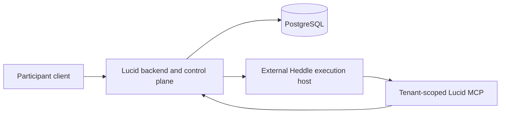

# External Heddle execution host

Lucid keeps hosted agent execution replaceable, but it does not embed or import
the private Heddle execution-host service. The current Lucid server executes
representative heartbeats in process. This document records the boundary that
must be preserved before moving the model and tool loop into an isolated
runtime such as Amazon Bedrock AgentCore Runtime.

## Current status

The external execution host currently supports one versioned
`conversation-turn` workflow. Lucid's representative workflow is not connected
to it yet. A representative wake still requires:

- a PostgreSQL-backed Heddle task claim, checkpoint, and fenced settlement;
- a Lucid wake claim and fixed mailbox horizon;
- stateful communication tools with visibility, provenance, and action-budget
  policy; and
- durable Lucid completion or failure settlement.

Adding an HTTP client before those responsibilities have a supported remote
contract would create unused code and falsely imply that hosted execution is
available.

## Why the current invocation target is local

`RepresentativeTaskInvocationTarget` is an internal delivery seam between the
bounded dispatcher and `RepresentativeAgentWorker`. Its input contains an
`AbortSignal`, its result is Heddle's targeted-task result, and its worker needs
both the PostgreSQL task store and the in-process heartbeat handler. It is not a
serializable wire contract.

The current targeted host remains valuable: it provides bounded local
concurrency, durable polling fallback, cancellation, recovery sweeps, and
graceful shutdown over Heddle's public task authority. Those responsibilities
stay in Lucid even when the model loop eventually runs elsewhere.

## Intended deployment boundary

The Lucid backend owns:

- end-user authentication and product authorization;
- adopter, tenant, subject, product-session, and invocation identity;
- Heddle task and Lucid wake lifecycle;
- PostgreSQL access and durable product settlement;
- execution-assertion issuance and replay policy; and
- the curated MCP capabilities exposed to one wake.

The external host owns:

- verification of the signed execution assertion;
- one Heddle model and tool loop;
- isolated temporary files and child processes;
- bounded event streaming and cancellation; and
- no Lucid database credentials or direct product-state authority.

The runtime calls product capabilities through authenticated MCP tools. Those
tools expose domain operations, not database CRUD. The backend derives scope
from a verified, short-lived capability rather than accepting tenant, user,
agent, or wake identity from model-controlled arguments.

Lucid must not depend on the private host as a source package. A future client
implements a Lucid-owned outbound port against a versioned wire contract. If a
generic contract must be shared at compile time, it belongs in a released
public Heddle entrypoint after real consumer evidence justifies it.

## Prerequisites for the first functional integration

1. Heddle exposes a supported provider-neutral way to execute the agent portion
   of a heartbeat while retaining its task claim, checkpoint, and settlement
   semantics in the backend.
2. The external host adds a versioned representative-workflow result and
   cancellation contract instead of accepting only a conversation prompt.
3. Lucid exposes stateless, authenticated MCP capabilities for the bounded
   communication tools without weakening wake-local policy or idempotency.
4. Lucid can issue short-lived asymmetric execution assertions and publish the
   corresponding verification keys without placing signing material in the
   runtime.
5. A local end-to-end test proves ordered streaming, exactly one terminal
   outcome, ambiguous-stream interruption, cancellation, durable wake
   settlement, and cross-scope MCP denial.
6. A separately approved AgentCore experiment proves managed header forwarding,
   session isolation, lifecycle behavior, and cost. Local containers cannot
   establish those provider properties.

The first functional Lucid code slice should introduce a product-owned
`RepresentativeAgentTurnExecutor` and a concrete external-host adapter only
when the service can exercise them through a real representative flow. Until
then, the existing in-process host remains the production code path.

## Security invariants

- The browser never invokes the execution host directly.
- Runtime-session identifiers are routing inputs, not authorization.
- Execution assertions and MCP capabilities use separate audiences and
  narrower authority.
- Identity comes from authenticated backend state, never prompts or tool
  arguments.
- The runtime receives no PostgreSQL URL, Lucid database credential, signing
  key, or broad AWS role.
- Secrets do not enter prompts, filesystem snapshots, child-process
  environments, traces, logs, or streamed activity.
- An accepted stream that ends without a terminal event is interrupted or
  unknown, never successful and never automatically replayed.
- AgentCore isolation is an additional tenant boundary, not a replacement for
  application authorization, capability checks, durable fencing, or redaction.
