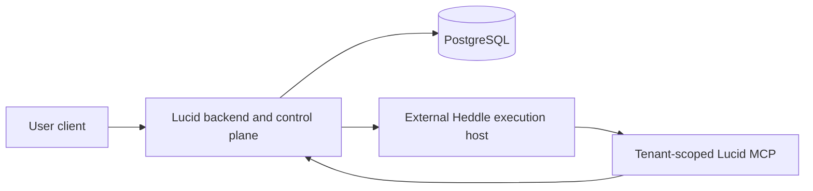

# External Heddle execution host

Lucid keeps hosted agent execution replaceable, but it does not embed or import
the private Heddle execution-host service. The current Lucid server executes
agent heartbeats in process. This document records the boundary that
must be preserved before moving the model and tool loop into an isolated
runtime such as Amazon Bedrock AgentCore Runtime.

## Current status

The external execution host supports one versioned `conversation-turn`
workflow. The released `@heddleagent/execution-host-client` package supplies the generic
adopter machinery:

- an ES256 authority service that issues separately typed execution and MCP
  credentials and projects public JWKS keys;
- a provider-neutral `ExecutionHost` port with a strict direct-development
  HTTP/SSE adapter; and
- independent product-edge MCP capability verification.

Lucid keeps only its domain boundary: an authenticated Streamable HTTP MCP
service exposing `read_workspace_snapshot` and binding the verified execution
subject to that user's product projection.

The public package owns generic JWT/JWKS, ordered SSE conformance, and the
durable requested/accepted/terminal lifecycle. Its official PostgreSQL adapter
implements the atomic lifecycle port over Lucid's supplied database handle.
When the
complete hosted profile is explicitly enabled, Lucid startup now loads an
owner-readable ES256 key, publishes public JWKS, mounts its product MCP edge,
and exposes an authenticated user conversation endpoint. It calls the
configured host through either the strict direct HTTP/SSE adapter or the
AgentCore AWS SDK adapter without importing private host code or sending a
database credential.

The local control-plane contract test runs the package-owned
`HostedConversationTurnService` through the public adopter contract fixture.
It mints real execution and MCP authority, traverses the strict HTTP/SSE wire,
calls Lucid's real local `read_workspace_snapshot` MCP tool, and observes one
clean terminal result. This proves the adopter-side composition without a
model, Docker, AWS, or the private host; it does not replace those later
evidence boundaries.

The optional startup-composition test separately crosses the package-owned
Node HTTP/JWKS/SSE and Streamable HTTP MCP services, Lucid product
admission, the direct host wire, a fake host, official-SDK MCP discovery/call,
and the user-scoped workspace projection. It proves that the complete
profile is wired while Lucid owns only route mounting and product policy.
The released package also supplies an AgentCore `ExecutionHost` adapter that
signs the same portable request and consumes the same strict stream through
the official AWS SDK. A real managed Heddle turn and one bounded high-level
session-isolation smoke have completed. These prove the research direction,
not production security or compliance. Lucid now exposes the authenticated
user's newest 20 direct prompts and truthful durable terminal records. Lucid
owns the authenticated bounded query, while Heddle owns lifecycle writes. It
does not persist activity, tool payloads, credentials, traces, or hidden
reasoning, and it does not yet provide replay or continuation.

Lucid's agent workflow is also not connected to the external host. A
agent wake still requires:

- a PostgreSQL-backed Heddle task claim, checkpoint, and fenced settlement;
- a Lucid wake claim and fixed mailbox horizon;
- stateful communication tools with visibility, provenance, and action-budget
  policy; and
- durable Lucid completion or failure settlement.

The conversation port must not be relabeled as agent execution.
Moving heartbeats requires a supported autonomous-task workflow and the same
durable claim and settlement semantics.

## Why the current invocation target is local

`AgentTaskInvocationTarget` is an internal delivery seam between the
bounded dispatcher and `AgentWorker`. Its input contains an
`AbortSignal`, its result is Heddle's targeted-task result, and its worker needs
both the PostgreSQL task store and the in-process heartbeat handler. It is not a
serializable wire contract.

The current targeted host remains valuable: it provides bounded local
concurrency, durable polling fallback, cancellation, recovery sweeps, and
graceful shutdown over Heddle's public task authority. Those responsibilities
stay in Lucid even when the model loop eventually runs elsewhere.

## Intended deployment boundary

The Lucid backend owns:

- end-user authentication and product authorization;
- adopter, tenant, subject, product-session, and invocation identity;
- Heddle task and Lucid wake lifecycle;
- PostgreSQL access, migration execution, and authenticated history queries;
- selection of the Heddle lifecycle store implementation;
- execution-assertion issuance and replay policy; and
- the curated MCP capabilities exposed to one wake.

The external host owns:

- verification of the signed execution assertion;
- one Heddle model and tool loop;
- isolated temporary files and child processes;
- bounded event streaming and cancellation; and
- no Lucid database credentials or direct product-state authority.

The runtime calls product capabilities through authenticated MCP tools. Those
tools expose domain operations, not database CRUD. The backend derives scope
from a verified, short-lived capability rather than accepting tenant, user,
agent, or wake identity from model-controlled arguments.

Lucid must not depend on the private host as a source package. It consumes the
versioned public contract and reference implementation from
`@heddleagent/execution-host-client`; provider-specific transports can implement the same
public `ExecutionHost` port without exposing host internals.

## Next integration sequence

1. Complete Google-backed user enrollment and verify one signed-in
   browser through Lucid, the managed Execution Host, and its scoped MCP tool.
2. Sharpen the user-facing social-product experience before adding
   deeper infrastructure or compliance work.
3. Treat the bounded durable terminal history as the product authority; add
   replay or continuation only for a separately selected user question.
4. Add an `autonomous-task` contract before replacing Lucid's in-process
   agent runner. Preserve PostgreSQL task/wake authority and expose
   stateful communication tools only with durable invocation-scoped policy.

## Security invariants

- The browser never invokes the execution host directly.
- Runtime-session identifiers are routing inputs, not authorization.
- Execution assertions and MCP capabilities use separate audiences and
  narrower authority.
- Identity comes from authenticated backend state, never prompts or tool
  arguments.
- The runtime receives no PostgreSQL URL, Lucid database credential, signing
  key, or broad AWS role.
- Secrets do not enter prompts, filesystem snapshots, child-process
  environments, traces, logs, or streamed activity.
- An accepted stream that ends without a terminal event is interrupted or
  unknown, never successful and never automatically replayed.
- AgentCore isolation is an additional tenant boundary, not a replacement for
  application authorization, capability checks, durable fencing, or redaction.
