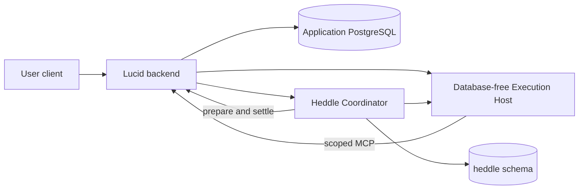

# External Heddle execution topology

Lucid keeps hosted agent execution replaceable. It does not embed or import
the private Heddle Execution Host or Coordinator services. Foreground hosted
conversations call the Runtime directly. Autonomous work has one scheduling
authority: the Heddle Coordinator.

## Current status

The external execution host supports versioned `conversation-turn` and
`heartbeat-task` workflows. The released
`@heddleagent/execution-host-client` package supplies the generic
adopter machinery:

- an ES256 authority service that issues separately typed execution and MCP
  credentials and projects public JWKS keys;
- a provider-neutral `ExecutionHost` port with a strict direct-development
  HTTP/SSE adapter; and
- independent product-edge MCP capability verification.

Lucid keeps only its domain boundary: an authenticated Streamable HTTP MCP
service exposing `read_workspace_snapshot` and binding the verified execution
subject to that user's product projection.

The public package owns generic JWT/JWKS, ordered SSE conformance, and the
durable requested/accepted/terminal lifecycle. Its official PostgreSQL adapter
implements the atomic lifecycle port over Lucid's supplied database handle.
When the
complete hosted profile is explicitly enabled, Lucid startup now loads an
owner-readable ES256 key, publishes public JWKS, mounts its product MCP edge,
and exposes an authenticated user conversation endpoint. It calls the
configured host through either the strict direct HTTP/SSE adapter or the
AgentCore AWS SDK adapter without importing private host code or sending a
database credential.

Model access is also request-scoped. By default Lucid asks Heddle to acquire a
fresh access-token-only credential from Lucid's existing OpenAI/Codex account
store. Heddle owns refresh and persistence at the Lucid boundary; neither the
Execution Host client nor Runtime receives refresh material. An explicitly
configured `LUCID_HOSTED_EXECUTION_MODEL_API_KEY` selects API-key mode instead.
The direct local profile can reach Lucid's JWKS and MCP endpoints through the
exact Docker Desktop `host.docker.internal` alias while keeping the browser and
Lucid-to-Runtime call on loopback.

The local control-plane contract test runs the package-owned
`HostedConversationTurnService` through the public adopter contract fixture.
It mints real execution and MCP authority, traverses the strict HTTP/SSE wire,
calls Lucid's real local `read_workspace_snapshot` MCP tool, and observes one
clean terminal result. This proves the adopter-side composition without a
model, Docker, AWS, or the private host; it does not replace those later
evidence boundaries.

The optional startup-composition test separately crosses the package-owned
Node HTTP/JWKS/SSE and Streamable HTTP MCP services, Lucid product
admission, the direct host wire, a fake host, official-SDK MCP discovery/call,
and the user-scoped workspace projection. It proves that the complete
profile is wired while Lucid owns only route mounting and product policy.
The released package also supplies an AgentCore `ExecutionHost` adapter that
signs the same portable request and consumes the same strict stream through
the official AWS SDK. A real managed Heddle turn and one bounded high-level
session-isolation smoke have completed. These prove the research direction,
not production security or compliance. Lucid now exposes the authenticated
user's newest 20 direct prompts and truthful durable terminal records. Lucid
owns the authenticated bounded query, while Heddle owns lifecycle writes. It
does not persist activity, tool payloads, credentials, traces, or hidden
reasoning, and it does not yet provide replay or continuation.

The separate Coordinator owns PostgreSQL-backed Heddle task claims,
checkpoints, recovery, and fenced settlement. Lucid supplies current desired
task state and a just-in-time `prepare` / `settle` product-work lifecycle.
`AgentWorkService` binds a fixed mailbox horizon to the Coordinator execution
ID, exposes only scoped communication tools, validates required durable
effects, and advances the product cursor only under the same execution fence.

The conversation port remains separate from autonomous agent execution.
Product trigger, status, and preference controls use the Coordinator API, and
no second scheduler can start inside Lucid.

## Coordinator-only heartbeat boundary

The Heddle Coordinator is the sole scheduler and PostgreSQL heartbeat-table
owner. Missing coordinator configuration fails Lucid startup rather than
silently selecting another topology. Lucid retains product mailbox and finding
state; autonomous product effects cross only the scoped MCP boundary and are
settled under the Coordinator execution fence.

## Intended deployment boundary

The `lucid` and `heddle` schemas coexist in Lucid's application database, with
separate migration histories and credentials. This deployment is for one
application. A different Heddle adopter owns its own application database,
product-work state, Heddle schema, Coordinator, and schedules; the hosted
Lucid stack is not a central multi-customer heartbeat authority.

The Runtime is database-free. It receives short-lived execution authority,
model access, and a product MCP capability, but no Lucid or Heddle database
credential.

## Ownership

The Heddle Coordinator owns:

- durable task definitions, cadence, enabled state, run requests, and
  checkpoints;
- due selection, coalescing, Heddle claims, leases, recovery, bounded
  concurrency, and Heddle run settlement; and
- invocation of the direct or AgentCore Execution Host.

Lucid owns:

- users, agents, product data, mailbox visibility, and product policy;
- desired task projection and user/operator controls;
- one durable `AgentWorkClaim` with a fixed event horizon for each Coordinator
  execution;
- product MCP schemas and effects;
- validation, cursor advancement, and product settlement under the exact
  Coordinator execution fence; and
- execution/MCP signing authority and authenticated product endpoints.

The Execution Host owns:

- verification of signed execution identity;
- one bounded Heddle model/tool loop;
- isolated temporary processes and files;
- strict event streaming and cancellation; and
- no scheduling or product persistence.

Lucid's work claim is not a scheduler. It does not poll time, calculate due
tasks, or acquire Heddle leases. It fixes which product input an already-owned
Coordinator attempt may inspect and mutate.

## Supported workflows

Foreground `conversation-turn` authority grants only
`read_workspace_snapshot`.

Autonomous `heartbeat-task` authority grants only
`read_available_messages`, `update_working_note`, and `post_shared_message`.
The intended happy path is:

1. product input is durably appended and the corresponding Coordinator task is
   triggered;
2. the Coordinator owns a Heddle execution ID and calls Lucid `prepare`;
3. Lucid claims a fixed work horizon or skips empty work before model cost;
4. Heddle mints execution and heartbeat-only MCP authority;
5. the Runtime reads the claim, updates guidance-derived working context when
   required, and publishes the required privacy-minimized request through
   Lucid MCP;
6. the Coordinator sends a narrow terminal projection to Lucid `settle`;
7. Lucid validates the durable effect, records completion, and advances its
   cursor under the same execution fence; and
8. the Coordinator commits its own result and checkpoint.

Failures and interruptions retain unread Lucid work. Retry side effects use the
retry-stable product work ID, while ownership uses the current Coordinator
execution ID. This lets a replacement attempt reuse committed effects without
allowing a stale attempt to settle the claim.

## Evidence state

Local deterministic tests now cover the full service contract:

- Coordinator preparation and settlement HTTP;
- workflow-specific signed MCP discovery and calls;
- Lucid claim, read, mutation, required-effect validation, completion, and
  cursor behavior; and
- execution-ID correlation across the boundary.

PostgreSQL tests additionally cover cross-process product-claim fencing when a
disposable test database is configured.

This does not yet prove the new path in the deployed stack. The remaining
acceptance sequence is:

1. merge and publish the new Execution Host client contract;
2. update and merge Lucid against that released version;
3. update the Coordinator and Lucid deployment secret name for the product
   execution lifecycle;
4. deploy Lucid and the Coordinator; and
5. submit one Lucid check whose observed evidence includes a product claim,
   scoped MCP read and write, Lucid cursor advancement, Coordinator terminal
   run, and AgentCore/model terminal result.

## Security invariants

- The browser never invokes the Execution Host directly.
- Runtime-session IDs are routing inputs, not authorization.
- Execution assertions and MCP capabilities have separate audiences and
  narrower authority.
- Identity and execution ownership come from verified claims, never prompts or
  tool arguments.
- The Runtime receives no PostgreSQL URL, product credential, signing key, or
  broad AWS role.
- The Coordinator receives no Lucid database credential or signing key.
- Secrets do not enter prompts, filesystem snapshots, child-process
  environments, traces, logs, or streamed activity.
- OAuth refresh material remains in Lucid's Heddle credential store; only one
  validated access-token credential crosses an invocation header.
- An accepted stream that ends without a terminal event is interrupted or
  unknown, never successful and never automatically replayed.
- AgentCore isolation complements application authorization, durable fencing,
  and redaction; it does not replace them.
