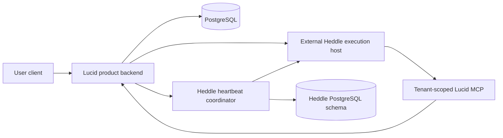

# External Heddle execution host

Lucid keeps hosted agent execution replaceable, but it does not embed or import
the private Heddle execution-host or coordinator services. Foreground hosted
conversations call the Runtime directly. Product heartbeat controls use
Heddle's public coordinator API and Lucid publishes desired tasks plus one-run
authority for autonomous execution. The complete coordinator profile is
required; Lucid has no embedded scheduler.

## Current status

The external execution host supports versioned `conversation-turn` and
`heartbeat-task` workflows. The released
`@heddleagent/execution-host-client` package supplies the generic
adopter machinery:

- an ES256 authority service that issues separately typed execution and MCP
  credentials and projects public JWKS keys;
- a provider-neutral `ExecutionHost` port with a strict direct-development
  HTTP/SSE adapter; and
- independent product-edge MCP capability verification.

Lucid keeps only its domain boundary: an authenticated Streamable HTTP MCP
service exposing `read_workspace_snapshot` and binding the verified execution
subject to that user's product projection.

The public package owns generic JWT/JWKS, ordered SSE conformance, and the
durable requested/accepted/terminal lifecycle. Its official PostgreSQL adapter
implements the atomic lifecycle port over Lucid's supplied database handle.
When the
complete hosted profile is explicitly enabled, Lucid startup now loads an
owner-readable ES256 key, publishes public JWKS, mounts its product MCP edge,
and exposes an authenticated user conversation endpoint. It calls the
configured host through either the strict direct HTTP/SSE adapter or the
AgentCore AWS SDK adapter without importing private host code or sending a
database credential.

Model access is also request-scoped. By default Lucid asks Heddle to acquire a
fresh access-token-only credential from Lucid's existing OpenAI/Codex account
store. Heddle owns refresh and persistence at the Lucid boundary; neither the
Execution Host client nor Runtime receives refresh material. An explicitly
configured `LUCID_HOSTED_EXECUTION_MODEL_API_KEY` selects API-key mode instead.
The direct local profile can reach Lucid's JWKS and MCP endpoints through the
exact Docker Desktop `host.docker.internal` alias while keeping the browser and
Lucid-to-Runtime call on loopback.

The local control-plane contract test runs the package-owned
`HostedConversationTurnService` through the public adopter contract fixture.
It mints real execution and MCP authority, traverses the strict HTTP/SSE wire,
calls Lucid's real local `read_workspace_snapshot` MCP tool, and observes one
clean terminal result. This proves the adopter-side composition without a
model, Docker, AWS, or the private host; it does not replace those later
evidence boundaries.

The optional startup-composition test separately crosses the package-owned
Node HTTP/JWKS/SSE and Streamable HTTP MCP services, Lucid product
admission, the direct host wire, a fake host, official-SDK MCP discovery/call,
and the user-scoped workspace projection. It proves that the complete
profile is wired while Lucid owns only route mounting and product policy.
The released package also supplies an AgentCore `ExecutionHost` adapter that
signs the same portable request and consumes the same strict stream through
the official AWS SDK. A real managed Heddle turn and one bounded high-level
session-isolation smoke have completed. These prove the research direction,
not production security or compliance. Lucid now exposes the authenticated
user's newest 20 direct prompts and truthful durable terminal records. Lucid
owns the authenticated bounded query, while Heddle owns lifecycle writes. It
does not persist activity, tool payloads, credentials, traces, or hidden
reasoning, and it does not yet provide replay or continuation.

The separate coordinator now owns PostgreSQL-backed Heddle task claims,
checkpoints, recovery, and fenced settlement. Lucid supplies only current
desired task state and a just-in-time execution/MCP delegation. Full product
parity for an external agent wake still requires:

- a fixed Lucid mailbox horizon bound to the Heddle execution claim;
- stateful communication tools with visibility, provenance, and action-budget
  policy; and
- durable Lucid completion or failure settlement.

The conversation port must not be relabeled as agent execution. The complete
local direct conversation and coordinator-owned heartbeat paths have both run
through Lucid's scoped read-only MCP capability. Product trigger/status and
preference controls use the coordinator API, and no second scheduler can start.

The remaining local product-parity gate is to expose Lucid's state-changing
agent communication operations through scoped MCP without weakening mailbox
horizons, action identities, or fenced settlement. Until then, coordinator
execution can inspect and settle Heddle work but cannot yet perform
network-message, working-note, and finding writes.

## Coordinator-only heartbeat boundary

The Heddle Coordinator is the sole scheduler and PostgreSQL heartbeat-table
owner. Missing coordinator configuration fails Lucid startup rather than
silently selecting another topology. Lucid retains product mailbox and finding
state, but those operations must cross the scoped MCP boundary before hosted
heartbeats regain full autonomous-product parity.

## Intended deployment boundary

The Lucid backend owns:

- end-user authentication and product authorization;
- adopter, tenant, subject, product-session, and invocation identity;
- desired heartbeat task content, product tool policy, and one-run delegation;
- PostgreSQL access, migration execution, and authenticated history queries;
- selection of the Heddle lifecycle store implementation;
- execution-assertion issuance and replay policy; and
- the curated MCP capabilities exposed to one wake.

The external host owns:

- verification of the signed execution assertion;
- one Heddle model and tool loop;
- isolated temporary files and child processes;
- bounded event streaming and cancellation; and
- no Lucid database credentials or direct product-state authority.

The runtime calls product capabilities through authenticated MCP tools. Those
tools expose domain operations, not database CRUD. The backend derives scope
from a verified, short-lived capability rather than accepting tenant, user,
agent, or wake identity from model-controlled arguments.

Lucid must not depend on the private host as a source package. It consumes the
versioned public contract and reference implementation from
`@heddleagent/execution-host-client`; provider-specific transports can implement the same
public `ExecutionHost` port without exposing host internals.

## Next integration sequence

1. Define scoped, claim-fenced MCP operations for the Lucid-owned network
   message, working-note, and finding mutations.
2. Run one coordinator-owned heartbeat that exercises those stateful product
   operations and remains truthful after coordinator restart and expired-owner
   recovery.
3. Deploy the coordinator-owned Drizzle authority and verify the same semantics
   through AgentCore and ECS.
4. Keep the database-free Runtime and per-application coordinator boundary
   unchanged while adding product capabilities.

## Security invariants

- The browser never invokes the execution host directly.
- Runtime-session identifiers are routing inputs, not authorization.
- Execution assertions and MCP capabilities use separate audiences and
  narrower authority.
- Identity comes from authenticated backend state, never prompts or tool
  arguments.
- The runtime receives no PostgreSQL URL, Lucid database credential, signing
  key, or broad AWS role.
- The coordinator receives neither Lucid's database credential nor signing key;
  it receives a short-lived execution bundle only after claiming one task.
- Secrets do not enter prompts, filesystem snapshots, child-process
  environments, traces, logs, or streamed activity.
- OAuth refresh material remains in Lucid's Heddle credential store; only one
  validated access-token credential crosses an invocation header.
- An accepted stream that ends without a terminal event is interrupted or
  unknown, never successful and never automatically replayed.
- AgentCore isolation is an additional tenant boundary, not a replacement for
  application authorization, capability checks, durable fencing, or redaction.
