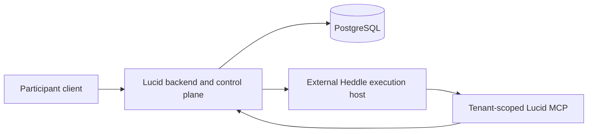

# External Heddle execution host

Lucid keeps hosted agent execution replaceable, but it does not embed or import
the private Heddle execution-host service. The current Lucid server executes
representative heartbeats in process. This document records the boundary that
must be preserved before moving the model and tool loop into an isolated
runtime such as Amazon Bedrock AgentCore Runtime.

## Current status

The external execution host supports one versioned `conversation-turn`
workflow. The released `@roackb2/heddle-adopter` package supplies the generic
adopter machinery:

- an ES256 authority service that issues separately typed execution and MCP
  credentials and projects public JWKS keys;
- a provider-neutral `ExecutionHost` port with a strict direct-development
  HTTP/SSE adapter; and
- independent product-edge MCP capability verification.

Lucid keeps only its domain boundary: an authenticated Streamable HTTP MCP
service exposing `read_workspace_snapshot` for the configured singleton pilot
and binding verified scope to the product workspace projection.

The public package owns generic JWT/JWKS and ordered SSE conformance. Lucid's
focused tests issue and verify authority through that released package, then
exercise exact product scope and tool checks, official-SDK MCP discovery and
calls, cancellation/cleanup, and secret exclusion. Lucid imports no private
host package, and the host receives no database credential.

These pieces are not yet composed into ordinary server startup. There is no
participant conversation endpoint, deployment key loader, public JWKS route,
mounted MCP route, AgentCore SDK adapter, or durable conversation record yet.
The code therefore establishes the adopter contract without claiming that a
hosted Lucid conversation is available.

Lucid's representative workflow is also not connected to the external host. A
representative wake still requires:

- a PostgreSQL-backed Heddle task claim, checkpoint, and fenced settlement;
- a Lucid wake claim and fixed mailbox horizon;
- stateful communication tools with visibility, provenance, and action-budget
  policy; and
- durable Lucid completion or failure settlement.

The conversation port must not be relabeled as representative execution.
Moving heartbeats requires a supported autonomous-task workflow and the same
durable claim and settlement semantics.

## Why the current invocation target is local

`RepresentativeTaskInvocationTarget` is an internal delivery seam between the
bounded dispatcher and `RepresentativeAgentWorker`. Its input contains an
`AbortSignal`, its result is Heddle's targeted-task result, and its worker needs
both the PostgreSQL task store and the in-process heartbeat handler. It is not a
serializable wire contract.

The current targeted host remains valuable: it provides bounded local
concurrency, durable polling fallback, cancellation, recovery sweeps, and
graceful shutdown over Heddle's public task authority. Those responsibilities
stay in Lucid even when the model loop eventually runs elsewhere.

## Intended deployment boundary

The Lucid backend owns:

- end-user authentication and product authorization;
- adopter, tenant, subject, product-session, and invocation identity;
- Heddle task and Lucid wake lifecycle;
- PostgreSQL access and durable product settlement;
- execution-assertion issuance and replay policy; and
- the curated MCP capabilities exposed to one wake.

The external host owns:

- verification of the signed execution assertion;
- one Heddle model and tool loop;
- isolated temporary files and child processes;
- bounded event streaming and cancellation; and
- no Lucid database credentials or direct product-state authority.

The runtime calls product capabilities through authenticated MCP tools. Those
tools expose domain operations, not database CRUD. The backend derives scope
from a verified, short-lived capability rather than accepting tenant, user,
agent, or wake identity from model-controlled arguments.

Lucid must not depend on the private host as a source package. It consumes the
versioned public contract and reference implementation from
`@roackb2/heddle-adopter`; provider-specific transports can implement the same
public `ExecutionHost` port without exposing host internals.

## Next integration sequence

1. Compose the authority, public JWKS route, fixed MCP route, scoped workspace
   reader, and direct host adapter behind an explicit hosted-conversation
   configuration. Load signing material from a reviewed secret boundary rather
   than source, Terraform state, or model-visible environment.
2. Exercise one real local conversation against the private host: the host must
   fetch JWKS, call `read_workspace_snapshot` through MCP, and return one clean
   terminal stream while swapped scope, expiry, cancellation, and ambiguous
   EOF fail closed.
3. Add durable invocation/replay and browser streaming semantics before calling
   the conversation path a supported product surface.
4. Apply checked-in migrations to the managed PostgreSQL project, deploy the
   stateless Lucid backend, and verify the existing local representative story
   against that database.
5. Only after separate resource-and-cost approval, deploy the host through the
   Terraform AgentCore template and repeat the managed header, stream,
   lifecycle, and tenant-isolation evidence.
6. Add an `autonomous-task` contract before replacing Lucid's in-process
   representative runner. Preserve PostgreSQL task/wake authority and expose
   stateful communication tools only with durable invocation-scoped policy.

## Security invariants

- The browser never invokes the execution host directly.
- Runtime-session identifiers are routing inputs, not authorization.
- Execution assertions and MCP capabilities use separate audiences and
  narrower authority.
- Identity comes from authenticated backend state, never prompts or tool
  arguments.
- The runtime receives no PostgreSQL URL, Lucid database credential, signing
  key, or broad AWS role.
- Secrets do not enter prompts, filesystem snapshots, child-process
  environments, traces, logs, or streamed activity.
- An accepted stream that ends without a terminal event is interrupted or
  unknown, never successful and never automatically replayed.
- AgentCore isolation is an additional tenant boundary, not a replacement for
  application authorization, capability checks, durable fencing, or redaction.
